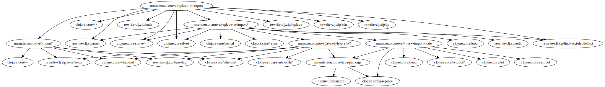

# Morpheus

Generate dependency graph(s) for variables in Clojure(Script) namespaces.

## Usage

Add an alias for `morpheus` in your deps.edn.

```clojure
{:aliases
  {:morpheus {:extra-deps {thomasa/morpheus {:git/url "https://github.com/benedekfazekas/morpheus.git"
                                             :sha "45365cf13383b9a31c87f8cad1c780af2518a61d"}}
              :main-opts ["-m" "thomasa.morpheus.main"]}}}
```

Run it in your project, provide directory to generate output files into -- directory needs to exist, format -- png, svg and dot is supported, latter is default -- and a list of paths to analyse.

Morpheus will generate a file per project variable with its dependency graph where nodes are other variables in the project or in one of the dependencies of the project.

```
clj -A:morpheus -m thomasa.morpheus.main -d graphs -f png src test
```

## Example



Uses [clj-kondo](https://github.com/borkdude/clj-kondo) to analyse namespaces under provided paths.
