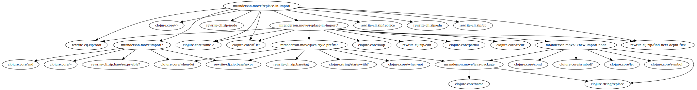

[](https://circleci.com/gh/benedekfazekas/morpheus)
[](https://codecov.io/gh/benedekfazekas/morpheus)

# Morpheus

Generate dependency graph(s) for variables in Clojure(Script) namespaces.

## Usage

Add an alias for `morpheus` in your deps.edn.

```clojure
{:aliases
  {:morpheus {:extra-deps {thomasa/morpheus {:git/url "https://github.com/benedekfazekas/morpheus.git"
                                             :sha "4e8c92edb6ddbeb176a132b3ee1867b2f42e9050"}}
              :main-opts ["-m" "thomasa.morpheus.main"]}}}
```

Run it in your project, provide directory to generate output files into -- directory needs to exist, format -- png, svg and dot is supported, latter is default -- and a list of paths to analyse.

Morpheus will generate a two files per project variable. One file with a given var's dependency graph where nodes are other variables in the project or in one of the dependencies of the project. The other file will show the usages of a project variable. Usages graphs are also generated for external vars, eg. vars of the dependencies of the project. For example:

```
clj -A:morpheus -d graphs -f png src test
```

Use `-r` option to generate graphs only for a given var and its dependencies. For example

```
clj -A:morpheus -d graphs -f png -r 'thomasa.morpheus.core/filename' src test
```

Use `-e` option to exclude some vars from the graphs generated by morpheus. For example

```
clj -A:morpheus -d graphs -f png -e 'clojure.core/.*|:clj-kondo/unknown-namespace/.*' src test
```

to filter out all clojure core vars and references to java interop calls.

For anything else than a dot file you need to have graphiz installed. Alternatively you can use a viewer online, for example [edotor](https://edotor.net/).

If you generate svg format you can leverage the references added to the graph nodes and the edges (arrows) between the nodes. You can navigate to subgraphs in your dependency tree by clicking an edge between two nodes. And toggle between the dependency graph and the usages graph by clicking a node. This means navigation has CHANGED compared to previous versions where clicking a node navigated to the subgraph.

## Example

Dependency graph



Usages graph


Uses [clj-kondo](https://github.com/borkdude/clj-kondo) to analyse namespaces under provided paths.
